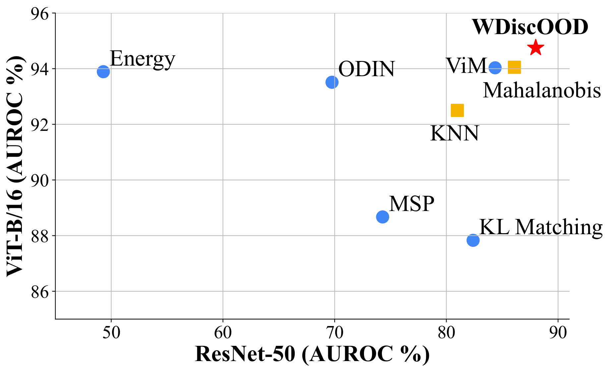

# WDiscOOD: Out-of-Distribution Detection via Whitened Linear Discriminant Analysis
Official implementation of ICCV2023 paper [WDiscOOD: Out-of-Distribution Detection via Whitened Linear Discriminant Analysis](https://arxiv.org/abs/2303.07543) by [Yiye Chen](https://yiyechen.github.io/), [Yunzhi Lin](https://yunzhi.netlify.app/), [Ruinian Xu](https://www.linkedin.com/in/gtsimonxu/), [Patricio A. Vela](https://pvela.gatech.edu/). It achieves state-of-the-art performance on multiple benchmarks.




## Preliminaries

The code is developed under the Ubuntu 20.04 and Python 3.9 environment. Please install the packages following the instructions below:

1. Install the [Pytorch](https://pytorch.org/).

   Following the instructions from the official website. The code is developed and tested with the Pytorch 1.11.0

2. Install the rest.

   ```bash
   pip install -r requirements.txt
   ```

   

## Dataset Preparation

- ID dataset
  - Download ImageNet-1k dataset from the [official Website](https://image-net.org/challenges/LSVRC/2012/index). Put the dataset in the folder ``data/imagenet``.

- OOD dataset
  - OpenImage-O: Follow the instruction from [ViM](https://github.com/haoqiwang/vim). Put the dataset in the folder ``data/openimaeg_o``
  - ImageNet-O: Follow the [official guidance](https://github.com/hendrycks/natural-adv-examples). Put the dataset in ``data/imagenet_o``
  - iNaturalist, SUN, Places, Textures: Follow the instruction from [MOS](https://github.com/deeplearning-wisc/large_scale_ood). Put them in ``data/inaturalist``, ``data/Places``, ``data/Textures``, and ``data/Textures``, respectively.


## Pretrained Models

1. ResNet-50 on ImageNet. No external download required. Will use the released model by Pytorch.

2. ResNet-Supcon on ImageNet. Download from [KNN-OOD](https://github.com/deeplearning-wisc/knn-ood#3--pre-trained-model), and place in ``./pretrained_models/ImageNet``

3. CLIP model. Install the API following [CLIP repo](https://github.com/openai/CLIP)


## Run experiments 

### Extract features

```bash
bash experiments/feat_imgNet.sh {resnet50|vit_b|resnet50_clip|resnet50_supcon}
```


### Test WDiscOOD 

```bash 
bash experiments/WDiscOOD_final.sh {resnet50|vit_b|resnet50_clip|resnet50_supcon}
```


### Test baselines

For classifier settings, test with:

```bash
bash experiments/run_baselines_clf_final.sh {resnet50|vit_b} {MSP|Energy|MahaVanilla|KNN|VIM|Residual|ReAct|ODIN}
```

For stand-alone visual encoders:

```bash
bash experiments/run_baselines_enc_final.sh {resnet50_supcon|resnet50_clip} {MahaVanilla|KNN}
```


# Acknowledgement

Part of the code is modified from [ViM](https://github.com/haoqiwang/vim), [MOS](https://github.com/deeplearning-wisc/large_scale_ood), and [KNN-OOD](https://github.com/deeplearning-wisc/knn-ood) repo.


# Citation
If you find WDiscOOD helpful in your research or application, please consider citing our paper:

    @article{chen2023wdiscood,
      title={WDiscOOD: Out-of-Distribution Detection via Whitened Linear Discriminative Analysis},
      author={Chen, Yiye and Lin, Yunzhi and Xu, Ruinian and Vela, Patricio A},
      journal={International Conference on Computer Vision (ICCV)},
      year={2023}
    }